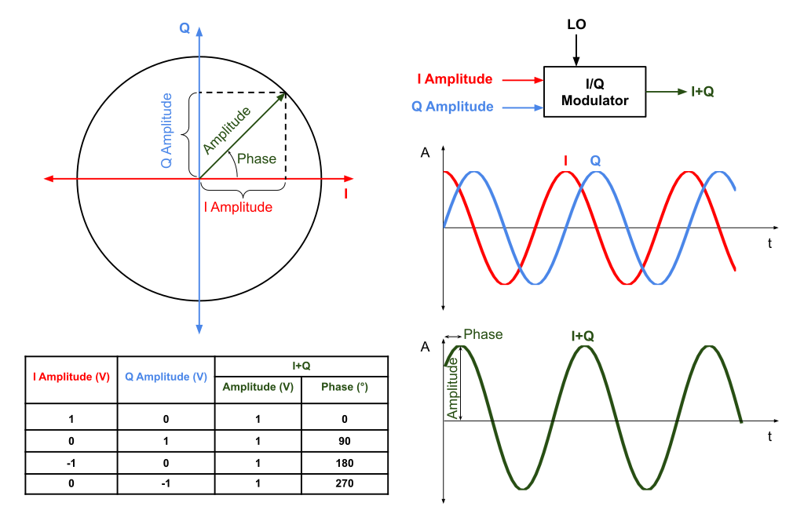

# Basics of signals
---

**Modulation**
- The manipulation of the amplitude, frequency or phase of an electromagnetic (EM) wave with the intent of transmitting information.

**Modulation Classification**
- In some use cases such as dynamic spectrum sensing in the commercial space and electronic warfare in militiary where one would like to infer the modulation type given just the received signal. This whole process is called as modualtion classificaiton.
    - It is an extension of signal detection, which is binary classificaiton problem - whether signal is present of not.

**Quadrature Signals**
- Two signals are said to be in quadrature when they are 90deg apart in phase.
    E.g. - Sine and Cosine are in quadrature.

- By convention the amplitude of the in=phase signal is **I**, I\*cos(2πft) and the amplitude of the 90 deg shifted signal is **Q**, Q\*sin(2πft).

**Addition of quadrature signals**
- If we vary I and Q identically, then the resulting signal will be amplitude modulated, i.e. the amplitude of the signal can be changed.
- If I=1, Q=0, then the resulting signal will be cosine only (I signal), similarly if I=0, Q=1, then the resulting signal will be sine only signal. This causes a phase modulation in the resulting signal. Frequency modulation is also a type of phase modulation. So, by appropriately varying the I and Q as function of time, the resulting signal can have any kind of modulation.
- Phasor diagrams can be used to represent output signals.

**Constellation diagram**
- Representation of a signal modulated by a digital modulation scheme such as quadrature modulation.
- 2-D XY-plane scatter diagram.
- Angle of a point gives the phase, distance gives the amplitude or pwoer of signal.
- For eg. - In 8-PSK - One constant amplitude is taken with 8 different phases to send 3-bits at a time.
- In digital modualtion, only finite number of bits can be sent, when we encounter noise in the signal we may not get the exact output but with some offset. therefore, we need some kind of decision boundary to categorize them.

**Some common digital modulation techniques**
- **Keying** - Family of modulation forms where the modulation signal takes one of a specific (predetermined) number of values at all times.

- PSK (phase-shift keying): a finite number of phases are used.
- FSK (frequency-shift keying): a finite number of frequencies are used.
- ASK (amplitude-shift keying): a finite number of amplitudes are used.
- QAM (quadrature amplitude modulation): a finite number of at least two phases and at least two amplitudes are used. Combination of PSK and ASK.

- In all the methods, each of the finite quantity is given a unique binary pattern. This comprises the *symbol* that is represented by the particular quantity.
